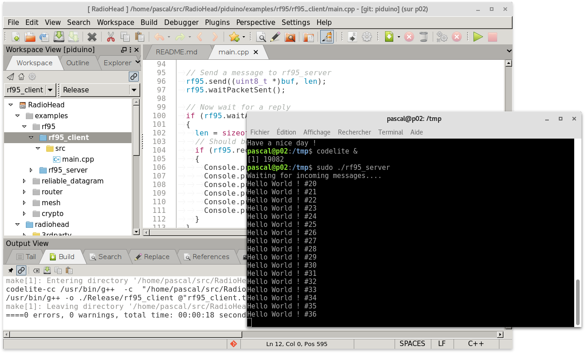
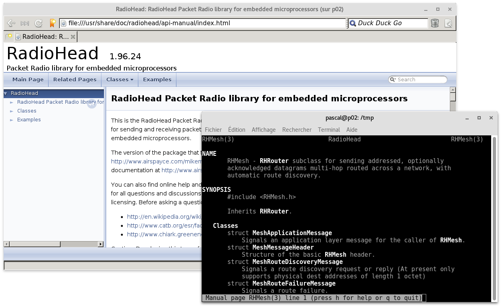
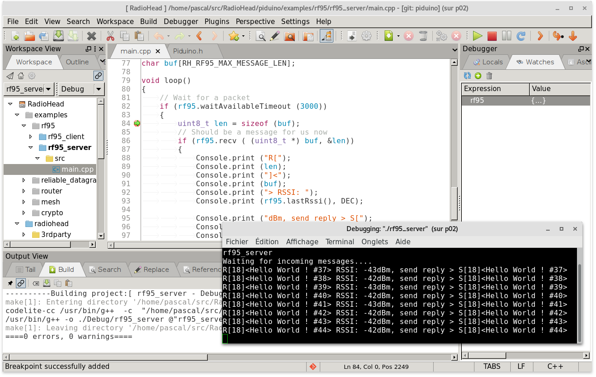

# RadioHead

This is the RadioHead Packet Radio library for embedded microprocessors. 
It provides a complete object-oriented library for sending and receiving 
packetized messages via a variety of common data radios and other transports 
on a range of embedded microprocessors.

This repository makes it easier for developers to access RadioHead so that they 
can offer improvements.

The [mikem branch](https://github.com/epsilonrt/RadioHead/tree/mikem) contains 
all versions of Mike McCauley without any modification. This branch contains its 
different original versions since 1.74.

The [master branch](https://github.com/epsilonrt/RadioHead) contains a modified 
version of the latest version of RadioHead provided by Mike McCauley.  
This version can be used, of course, on Arduino, but also and above all Pi 
boards (Raspberry Pi, Nano Pi ...) using the 
[piduino](https://github.com/epsilonrt/piduino) library.

|  | 
|:--:| 
| *Easily build and run a RadioHead application on Pi board with CodeLite (or gcc, or CMake...)* |

On Armbian or Raspbian, RadioHead is provided by APT packages which allow to 
install the shared library (radiohead package), but also all the functionalities 
to quickly compile your program with [gcc](https://gcc.gnu.org/) and 
[pkg-config](https://www.freedesktop.org/wiki/Software/pkg-config/), 
[CMake](https://cmake.org/) and [Codelite](https://codelite.org/)
(radiohead-dev package).  
This package also contains the source code for using RadioHead under the Arduino IDE.   
The documentation is in a separate package (radiohead-doc) which contains the 
HTML documentation 
([/usr/share/doc/radiohead/api-manual/index.html](http://www.airspayce.com/mikem/arduino/RadioHead)) 
but also the manual pages (i.e. `man RH_RF95`).

|  | 
|:--:| 
| *Easily consult the documentation using man pages* |

## Trademarks

RadioHead is a trademark of AirSpayce Pty Ltd. The RadioHead mark was first used 
on April 12 2014 for international trade, and is used only in relation to data 
communications hardware and software and related services.  
It is not to be confused with any other similar marks covering other goods and services.

## Donations

This library is offered under a free GPL license for those who want to use it 
that way. We try hard to keep it up to date, fix bugs and to provide free support.  
If this library has helped you save time or money, please consider donating at http://www.airspayce.com

## Quickstart guide

### Installation on Pi Board

The fastest and safest way to install radiohead on Armbian or Raspbian 
is to use the APT repository from [piduino.org](http://apt.piduino.org), 
so you should do the following :

    wget -O- http://www.piduino.org/piduino-key.asc | sudo apt-key add -
    sudo add-apt-repository 'deb http://apt.piduino.org stretch piduino'
    sudo apt update
    sudo apt install radiohead radiohead-dev radiohead-doc 

The last command will also install piduino and all of its dependencies.

This repository provides RadioHead packages for `armhf` and `arm64` architectures.  

In the above commands, the repository is a Debian Stretch distribution, but you 
can also choose Buster, Ubuntu Bionic by replacing `stretch` with `buster` or 
`bionic`. It may be necessary to install the `software-properties-common` 
package for `add-apt-repository`.

For Raspbian you have to do a little different :

    wget -O- http://www.piduino.org/piduino-key.asc | sudo apt-key add -
    echo 'deb http://raspbian.piduino.org stretch piduino' | sudo tee /etc/apt/sources.list.d/piduino.list
    sudo apt update
    sudo apt install radiohead radiohead-dev radiohead-doc

The Raspbian repository provides RadioHead packages for `armhf` architecture for Stretch or Buster.

If you want to build from sources, you can follow the 
[Wiki](https://github.com/epsilonrt/radiohead/wiki/Build-from-source).

### Setting up the hardware

In order for the library to access the radio module you are using, you will need 
to activate the necessary hardware.  
For example, if you use a SPI radio module, you will have to activate the SPI 
bus in `raspi-config`, `armbian-config`...

After restarting, you can check that piduino correctly detects the board model 
and the link used with `pinfo`, for example:

    $ pinfo
    Name            : NanoPi Neo Core2 Mini Shield
    Family          : NanoPi
    Database Id     : 40
    Manufacturer    : Friendly ARM
    Board Tag       : nanopineocore2shield
    SoC             : H5 (Allwinner)
    Memory          : 1024MB
    GPIO Id         : 9
    I2C Buses       : /dev/i2c-0
    SPI Buses       : /dev/spidev1.0

Here we see that the board is a **NanoPi Neo Core2** with a minishield, and that 
the SPI link used is `/dev/spidev1.0` (i.e. SPI bus number 1, chip select SPI1CS).

To locate the pins to use on the connector, we use pido:

    $ pido readall 1
                                              CON1 (#1)
    +-----+-----+----------+------+------+---+----++----+---+------+------+----------+-----+-----+
    | sOc | iNo |   Name   | Mode | Pull | V | Ph || Ph | V | Pull | Mode |   Name   | iNo | sOc |
    +-----+-----+----------+------+------+---+----++----+---+------+------+----------+-----+-----+
    |     |     |     3.3V |      |      |   |  1 || 2  |   |      |      | 5V       |     |     |
    |  12 |   8 |  GPIOA12 |  OFF |  OFF |   |  3 || 4  |   |      |      | 5V       |     |     |
    |  11 |   9 |  GPIOA11 |  OFF |  OFF |   |  5 || 6  |   |      |      | GND      |     |     |
    |  91 |   7 |  GPIOG11 |  OFF |  OFF |   |  7 || 8  |   | OFF  | OFF  | GPIOG6   | 15  | 86  |
    |     |     |      GND |      |      |   |  9 || 10 |   | OFF  | OFF  | GPIOG7   | 16  | 87  |
    |   0 |   0 |   GPIOA0 |  OFF |  OFF |   | 11 || 12 |   | OFF  | OFF  | GPIOA6   | 1   | 6   |
    |   2 |   2 |   GPIOA2 |  OFF |  OFF |   | 13 || 14 |   |      |      | GND      |     |     |
    |   3 |   3 |   GPIOA3 |  OFF |  OFF |   | 15 || 16 |   | OFF  | OFF  | GPIOG8   | 4   | 88  |
    |     |     |     3.3V |      |      |   | 17 || 18 |   | OFF  | OFF  | GPIOG9   | 5   | 89  |
    |  15 |  28 | SPI1MOSI | ALT2 |  OFF |   | 19 || 20 |   |      |      | GND      |     |     |
    |  16 |  24 | SPI1MISO | ALT2 |  OFF |   | 21 || 22 |   | OFF  | OFF  | GPIOA1   | 6   | 1   |
    |  14 |  29 |  SPI1CLK | ALT2 |  OFF |   | 23 || 24 |   | OFF  | ALT2 | SPI1CS   | 27  | 13  |
    |     |     |      GND |      |      |   | 25 || 26 |   | OFF  | OFF  | GPIOA17  | 11  | 17  |
    +-----+-----+----------+------+------+---+----++----+---+------+------+----------+-----+-----+
    | sOc | iNo |   Name   | Mode | Pull | V | Ph || Ph | V | Pull | Mode |   Name   | iNo | sOc |
    +-----+-----+----------+------+------+---+----++----+---+------+------+----------+-----+-----+

Here, we can see that the SPI1 signals are present on pins 19, 21, 23 and 24. 
Note that the chip select corresponds to pin number 27 for piduino.

For example for an RFM95 module, you must indicate the pin numbers corresponding 
to CS and the interrupt pin to the constructor of RH_RF95. For example :

```cpp
RH_RF95 rf95 (27, 6);
```

Here, pin 27 piduino corresponds to pin 24 of the connector, i.e. SPI1CS. Pin 6 
piduino corresponds to pin 22 of the connector which will be used as the 
interrupt pin connected to DIO0 on the module.

### How To build an example ?

Here is a complete example that can be compiled without error:

```cpp
#include <Piduino.h>
#include <RH_RF95.h>

const float frequency = 868.0;
RH_RF95 rf95 (27, 6);

void setup()
{
	Console.begin (115200);
	if (!rf95.init())
	{
		Console.println ("init failed");
		exit (EXIT_FAILURE);
	}
	rf95.setFrequency (frequency);
	Console.println ("Waiting for incoming messages....");
}

// Dont put this on the stack:
char buf[RH_RF95_MAX_MESSAGE_LEN];

void loop()
{
	if (rf95.waitAvailableTimeout (3000))
	{
		uint8_t len = sizeof (buf);
		if (rf95.recv ( (uint8_t *) buf, &len))
		{
			Console.println (buf);
			// send the received packet in response
			rf95.send ( (uint8_t *) buf, len);
			rf95.waitPacketSent();
		}
	}
}
```

Enter the text of this program with your favorite text editor and save the file 
in `main.cpp`

To build, you must type the command:

    g++ -o rf95_server main.cpp $(pkg-config --cflags --libs radiohead)
    
You can then run it :

    sudo ./rf95_server 
    Waiting for incoming messages....

If you send using another board, for example an Arduino board with RFM95 shield, 
using the program [rf95_client.pde](examples/rf95/rf95_client/rf95_client.pde), 
you will see the received packets displayed :

    Hello World ! #1
    Hello World ! #2
    Hello World ! #3

You will find several examples in the folder [/usr/share/doc/radiohead/examples](piduino/examples)

With [Codelite](https://codelite.org/) it's easier and funny, right ? 

|  | 
|:--:| 
| *Easily debug a RadioHead application on Pi board with CodeLite (or gdb, or cgdb...)* |

## Copyright

This software is Copyright (C) 2011-2018 Mike McCauley. Use is subject to license conditions. 
The main licensing options available are GPL V2 or Commercial:

### Open Source Licensing GPL V2

This is the appropriate option if you want to share the source code of your application with everyone you distribute it to, 
and you also want to give them the right to share who uses it. 
If you wish to use this software under Open Source Licensing, you must contribute all your source code to the open 
source community in accordance with the GPL Version 2 when your application is distributed. 
See https://www.gnu.org/licenses/gpl-2.0.html

### Commercial Licensing

This is the appropriate option if you are creating proprietary applications and you are not prepared to distribute and 
share the source code of your application. To purchase a commercial license, contact info@airspayce.com
